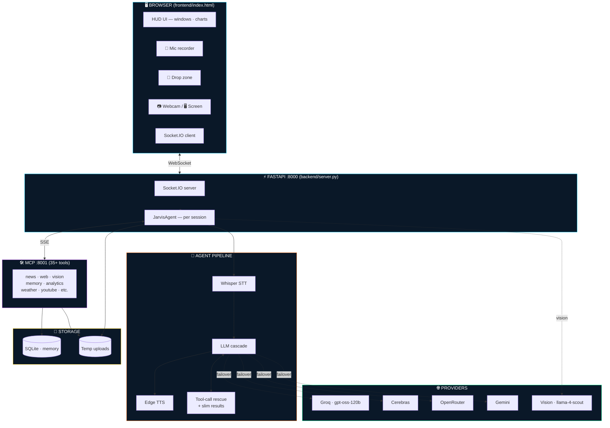

<div align="center">

#  J.A.R.V.I.S.

### *Just A Rather Very Intelligent System*

**A voice-first holographic AI command center inspired by Iron Man — actually functional.**

[](https://www.python.org)
[](https://fastapi.tiangolo.com)
[](https://socket.io)
[](https://modelcontextprotocol.io)
[](https://plotly.com/javascript)
[](LICENSE)

*Voice · Vision · Memory · Live Data · 3D Analytics · Multi-LLM Failover*

</div>


---

##  What it does

JARVIS is a **production-grade conversational AI command center** that runs entirely on free-tier APIs. Talk to it. Show it images. Drop in spreadsheets. Watch it respond with synthesised speech, animated HUD windows, interactive 3D charts, and real-time data feeds — all wrapped in a Stark-Industries-grade UI.

```
🎤 "JARVIS, analyse the sales data I just dropped"
🎤 "Pull up the latest world news on the holographic display"
🎤 "What's on my screen right now?"
🎤 "Remember that I prefer dark mode and Italian food"
```

---

## 🚀 Highlights

| Capability | What it actually does |
|---|---|
| 🎤 **Voice I/O** | Groq Whisper-large-v3 STT (with hallucination filter) + Edge-TTS for British "Jarvis" voice |
| 👁️ **Vision** | Drop image / capture screen / capture webcam → Llama-4-Scout / Gemini-2.5 vision LLM describes, OCRs, identifies objects, analyses charts |
| 🧠 **Long-term memory** | SQLite-backed persistent store. Remembers user facts/preferences across sessions, auto-injects top 12 into system prompt every turn |
| 📊 **Live data analytics** | Drop CSV/Excel/JSON/Parquet → automatic chart selection, 3D Plotly scatter, neural-network architecture viz, full statistical summary |
| 🌐 **Multi-LLM failover** | Groq → Cerebras → OpenRouter → Gemini cascade with **per-model cooldown registry**. Daily-cap exceeded? Auto-skip until tomorrow |
| 🛠️ **35+ MCP tools** | News, web search, Wikipedia, weather, YouTube, world map, crypto, stocks, vision, memory, analytics — all served over SSE on port 8001 |
| 🪟 **Cinematic HUD** | Animated multi-window stage, draggable panels, maximize toggle, scan-line effects, tactical overlay |
| ⚡ **Cross-process file resolver** | Files uploaded to FastAPI are findable from the separate MCP process via shared disk + SID lookup |
| 🩹 **Self-healing tool calls** | Detects when LLM emits tool calls as raw `<function=...>` text instead of structured JSON → parses & rescues automatically |

---

## 🏗️ Architecture



📐 **More diagrams (request flow, tool tree):** see [`docs/ARCHITECTURE.md`](docs/ARCHITECTURE.md)

---

## ⚡ Quick start

> Get JARVIS talking in **under 60 seconds**.

```bash
# 1. Clone
git clone https://github.com/<your-username>/jarvis.git
cd jarvis

# 2. Create venv + install
python -m venv venv
venv\Scripts\activate          # macOS/Linux: source venv/bin/activate
pip install -r requirements.txt

# 3. Configure
copy .env.example .env          # macOS/Linux: cp .env.example .env
# Edit .env and add your free Groq key — that's the only required field
# Get one here: https://console.groq.com/keys (no card needed)

# 4. Run
start.bat                       # Windows
# or:
./start.sh                      # macOS/Linux
```

Then open <http://localhost:8000> and start talking.

---

## 🎙️ How to talk to JARVIS

| Say this | What happens |
|---|---|
| *"What time is it"* | Speaks the time, opens a clock window |
| *"Show me the latest world news"* | Pulls live RSS feeds, opens news wire |
| *"Pull up the world map"* | Opens animated 3D world map |
| *"Search the web for quantum computing"* | DuckDuckGo + Wikipedia + abstract |
| *"Play AC/DC on YouTube"* | Searches, embeds, autoplays |
| *"Analyse the file I uploaded"* | Loads CSV → picks chart type → renders Plotly |
| *"Plot a 3D chart of these"* | Interactive rotatable 3D scatter |
| *"Show me as a neural network"* | Visualises columns as input/output nodes |
| *"What's in this image?"* | Vision LLM describes uploaded image |
| *"What's on my screen?"* | Server-side screenshot → vision analysis |
| *"Remember I'm a backend dev"* | Persisted to SQLite, recalled next session |
| *"What do you remember about me?"* | HUD memory bank panel with categories |
| *"Open weather"* | Live weather panel for your location |

---

## 🧠 Engineering details (the recruiter-friendly bits)

### Multi-provider LLM failover with per-model cooldowns

```python
# backend/llm.py
async def generate(messages, tools, system, temperature):
    for cfg in providers:                    # groq → cerebras → openrouter → gemini
        for model in cfg.default_models:
            if _is_in_cooldown(cfg.name, model):
                continue                     # skip without HTTP round-trip
            try:
                return await _call_openai_compatible(cfg, model, ...)
            except LLMError as exc:
                cd_secs = _parse_cooldown_seconds(str(exc))
                if cd_secs > 0:
                    _set_cooldown(cfg.name, model, cd_secs)   # park dead models
```

When Groq returns `"try again in 51m45s"`, that exact model is parked for **51 minutes 45 seconds**. No more pointless retries on a daily-quota-exhausted model.

### Self-healing tool calls

Some Llama models emit tool calls as raw text instead of structured JSON:

```text
<function=analyze_file>{"filename": "sales.csv", "sid": "abc"}</function>
```

The agent detects this, regex-parses it back into a real `ToolCall`, removes it from the spoken response so it never leaks to the user, and executes the call as if the model had emitted it correctly.

### Token-efficient tool results

Plotly chart specs run **~98 KB**. Sending them back to the LLM blew up the per-minute token cap. Solution: a `_slim_tool_result()` pass that strips heavy fields before round 2.

| Tool | Original size | Slimmed | Reduction |
|---|---|---|---|
| `analyze_file` | 98 KB | 235 B | **99.8%** |
| `get_world_news` | ~12 KB | ~1.5 KB | **87%** |
| `search_web` | ~8 KB | ~700 B | **91%** |

### Cross-process file resolution

The FastAPI server (uploads) and the MCP server (analytics tools) run as **separate Python processes**, so an in-memory file registry was insufficient. Solution: `data_store.py` falls back to a disk scan when the in-memory dict misses, with three resolution tiers (exact match → most-recent in SID → most-recent across all sessions).

### Persistent memory layer

```sql
CREATE TABLE memories (
    id INTEGER PRIMARY KEY,
    content TEXT NOT NULL,
    category TEXT,         -- preference | fact | event | note | identity | skill
    importance INTEGER,    -- 1 (trivia) → 5 (critical)
    created_at TEXT,
    last_used TEXT,
    access_count INTEGER
);
```

Top 12 memories ranked by `(importance DESC, last_used DESC)` are injected into the system prompt every turn. JARVIS feels continuous across sessions without bloating the context window.

---

## 🧩 Project structure

```
jarvis/
├── backend/
│   ├── server.py            # FastAPI + Socket.IO entry point
│   ├── jarvis_agent.py      # per-session orchestrator
│   ├── llm.py               # multi-provider failover + cooldowns
│   ├── vision_llm.py        # multi-modal LLM cascade
│   ├── stt.py               # Whisper STT with hallucination filter
│   ├── tts.py               # Edge TTS
│   ├── memory.py            # SQLite persistent store
│   ├── data_store.py        # cross-process file resolver
│   ├── livekit_room.py      # optional low-latency audio
│   └── tools/
│       ├── news.py          # world / finance / tech RSS
│       ├── web.py           # DuckDuckGo + Wikipedia
│       ├── weather.py       # Open-Meteo
│       ├── youtube.py       # search + embed
│       ├── analytics.py     # CSV/Excel → Plotly
│       ├── vision.py        # describe / OCR / objects / chart
│       └── windows.py       # HUD window dispatch
├── mcp_server/
│   └── server.py            # FastMCP, registers all tools over SSE :8001
├── frontend/
│   └── index.html           # HUD UI — single file, no build step
├── docs/
│   └── ARCHITECTURE.md      # full diagrams + sequence flows
├── requirements.txt
├── start.bat / start.sh     # one-command launcher
├── .env.example             # env template
└── README.md
```

---

## 🛠️ Tech stack

**Backend** Python 3.10 · FastAPI · Socket.IO · FastMCP · httpx · SQLite · pandas · scikit-learn  
**LLMs** Groq (Llama-3.3-70B, gpt-oss-120b) · Cerebras · OpenRouter · Gemini · Llama-4-Scout vision  
**Speech** Groq Whisper-large-v3 (STT) · Microsoft Edge-TTS (synthesis)  
**Frontend** Vanilla JS · Socket.IO client · Plotly.js · CSS Grid · custom HUD aesthetic  
**Optional** LiveKit (low-latency audio) · MSS (server-side screenshot) · Pillow

---

## 🗺️ Roadmap

- [x] Multi-LLM failover with per-model cooldowns
- [x] Long-term memory (SQLite)
- [x] Vision (image upload, screen capture, webcam)
- [x] Data analytics (CSV → 3D charts)
- [x] Self-healing tool calls
- [ ] Wake word ("Hey JARVIS")
- [ ] System control (open apps, volume, screenshot)
- [ ] Code execution sandbox
- [ ] PDF analyst
- [ ] Streaming TTS (sentence-by-sentence)
- [ ] Image generation (Pollinations.ai)
- [ ] Mobile-responsive UI
- [ ] Plugin loader (drop a `.py` in `tools/`, auto-register)

---

## 🤝 Contributing

PRs welcome — particularly new MCP tools. To add one:

1. Drop a function in `backend/tools/your_tool.py`
2. Wrap with `@mcp.tool()` in `mcp_server/server.py`
3. (Optional) Add a UI handler in `_build_ui_event` to show results in the HUD
4. Restart the MCP server — JARVIS will auto-discover the tool

---

## 🙏 Credits & inspiration

- **Tony Stark / Marvel** — the original JARVIS concept (this is a non-commercial fan tribute)
- **Groq** — for absurdly fast & free inference
- **Anthropic** — for the [Model Context Protocol](https://modelcontextprotocol.io)
- **Plotly** — for the 3D chart magic
- **Microsoft Edge** — for the surprisingly good free TTS voices

---

## 📜 License

MIT — see [LICENSE](LICENSE).

> J.A.R.V.I.S. is a fan tribute to Tony Stark / Marvel. Not affiliated with Marvel Entertainment or The Walt Disney Company.

---

<div align="center">

**⭐ If this project helped you or made you smile, leave a star.**

*Built with caffeine and an unreasonable love for Iron Man.*

</div>
