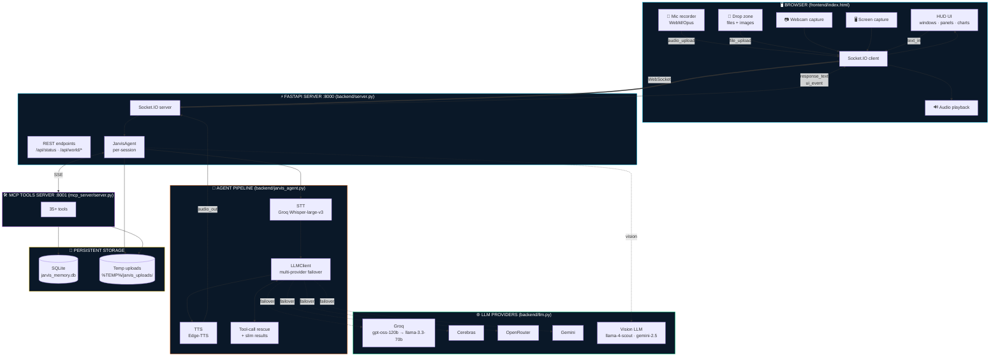
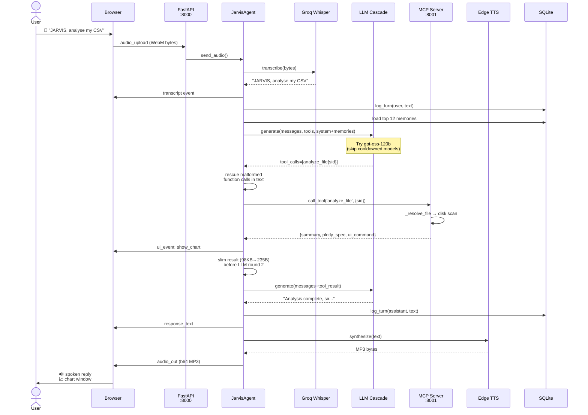
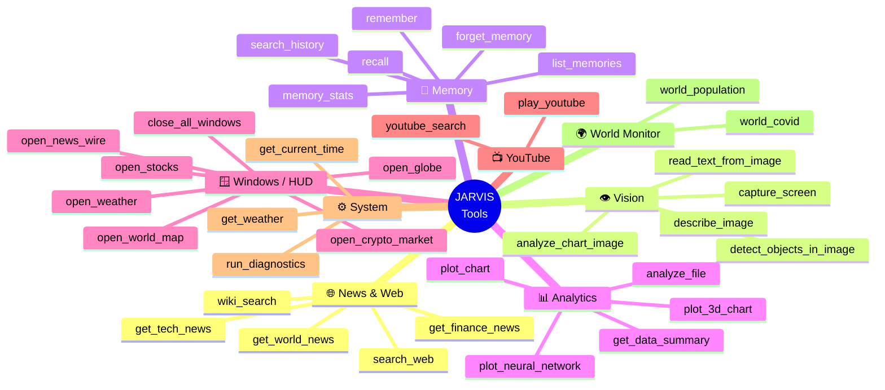

# 🏗️ JARVIS — System Architecture

A deep dive into the internals. Three diagrams: **components**, **request flow**, and the **tool ecosystem**.

---

## 1. Component overview



---

## 2. Single-turn request flow



---

## 3. Tool ecosystem (35+ tools)



---

## 4. Key engineering decisions

### Why FastMCP + SSE?

The Model Context Protocol gives us tool definitions, schemas, and call routing for free. SSE lets the agent stream tool catalogue updates without re-establishing a connection. The MCP server runs in its own process so a tool crash can't take down the FastAPI server.

### Why an in-memory + on-disk file store?

The FastAPI process and the MCP process are separate. A pure in-memory dict only solves half the problem — uploads happened in process A but tools resolve files in process B. The disk fallback (with three-tier resolution) makes the cross-process boundary invisible to the LLM.

### Why slim tool results before round 2?

Plotly chart specs are ~98 KB. Sending that back to the LLM as a tool result would burn through Groq's per-minute token cap (6,000 TPM) on a single call. The slim pass strips heavy fields, keeps the LLM-relevant summary, and reduces token usage by 87–99%.

### Why per-model cooldowns?

When Groq's `llama-3.3-70b-versatile` hits its daily cap, the error message helpfully says `"try again in 51m45s"`. Without a cooldown registry, every subsequent request burns 1–2 seconds retrying that dead model before falling through. With cooldowns, dead models are skipped instantly until their `ready_at` timestamp passes.

### Why two-step tool-call rescue?

Groq's Llama models occasionally emit tool calls as raw text:

```text
<function=analyze_file>{"filename":"sales.csv"}</function>
```

…instead of using the OpenAI structured `tool_calls` field. Without rescue, this leaks into the spoken response and confuses the user. The rescue parser:

1. Detects the pattern in `resp.content`
2. Parses out the function name + JSON arguments
3. Promotes them into real `ToolCall` objects
4. Strips the leakage from the spoken text
5. Executes the tool as if the model had emitted it correctly

---

## 5. Performance characteristics

| Operation | Median latency |
|---|---|
| STT (10s clip) | ~800 ms |
| LLM round-trip (text only) | ~700 ms |
| LLM round-trip (with tool call) | ~1.4 s |
| Tool execution (cached) | <50 ms |
| Tool execution (cold web) | 200–600 ms |
| TTS synthesis (50 words) | ~300 ms |
| **Total: voice in → voice out** | **~2.5 s** |

Memory footprint: ~120 MB resident (FastAPI + MCP combined, idle).

---

## 6. Scaling considerations

The current design assumes a single user / single host. To scale:

- **Sessions** — `_agents: dict[sid → JarvisAgent]` is in-memory. Move to Redis for horizontal scaling.
- **File storage** — `%TEMP%` is local disk. Move to S3 / object storage for multi-host.
- **Memory DB** — single SQLite file, fine for one user. For multi-tenant, switch to PostgreSQL with a `user_id` partition key.
- **MCP server** — currently one process. Could run multiple instances behind a load balancer if tool catalogues are stateless.

The bottleneck is always the LLM provider's rate limit, not local compute.
